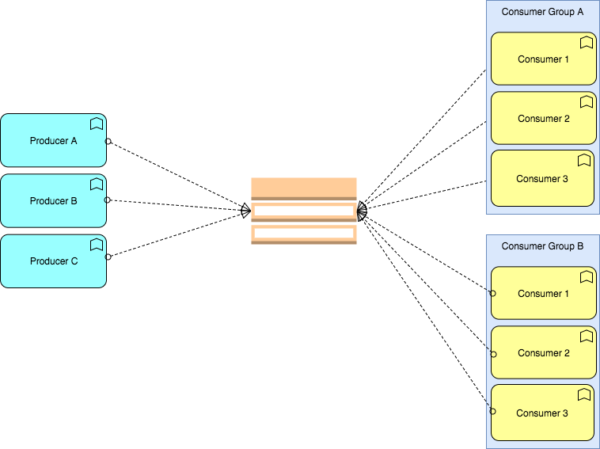

# Remit

[](https://travis-ci.org/jpwilliams/remit) [](https://coveralls.io/github/jpwilliams/remit?branch=v2) [](https://www.npmjs.com/package/remit) [](https://www.npmjs.com/package/remit)

# What is Remit?

*A node.js service mesh for building event-driven microservices with batteries included.*

It is built atop [RabbitMQ](http://www.rabbitmq.com) as an [ESB](https://en.wikipedia.org/wiki/Enterprise_service_bus)

# Why Remit?
- [x] Service discovery
- [x] Consumer groups
- [x] Middleware
- [x] Request/Response RPC
- [x] PubSub (aka send-and-forget) messaging
- [ ] Tracing (_not yet_)



---

# Getting started
```sh
brew install rabbitmq
npm install remit
```

---

# API

- [`Remit`](#)
  - [`Types`](#types)
    - [`ConnectionOpts`](#connectionopts)
    - [`RequestOpts`](#requestopts)
    - [`EmitOpts`](#emitopts)
    - [`EndpointOpts`](#endpointopts)
    - [`ListenerOpts`](#listeneropts)   
    - [`Handler`](#handler)
    - [`Event`](##event)
    - [`Data`](#data)
    - [`EventTarget`](#eventtarget)

  - [`Remit([ConnectionOpts])`](#requestconnectionopts)
    - [`request(name | RequestOpts [, Data ])`](#requestname--requestopts-data)
      - [`request(name | RequestOpts, Data) (Promise)`](#requestname--requestopts-data-promise)
      - [`request(name | RequestOpts)(Data) (Promise)`](#requestname--requestoptsdata-promise)
      - [`request(name | RequestOpts).send(Data) (Promise)`](#requestname--requestoptssenddata-promise)
      - [`request.options(opts) (Remit)`](#requestoptionsopts-remit)
      - [`request.fallback(Data) (Remit)`](#requestfallbackdata-remit)
      - [`request.on(EventTarget, Handler) (Remit)`](#requestonevent-handler-remit)
      - [`request.ready() (Promise)`](#requestready-promise)

    - [`emit(name | EmitOpts [, Data ])`](#emitname--emitopts--data-)
      - [`emit(name | EmitOpts, Data) (Promise)`](#emitname--emitopts-data-promise)
      - [`emit(name | EmitOpts)(Data) (Promise)`](#emitname--emitoptsdata-promise)
      - [`emit(name | EmitOpts).send(Data) (Promise)`](#emitname--emitoptssenddata-promise)
      - [`emit.options(EmitOpts) (Remit)`](#emitoptionsemitopts-remit)
      - [`emit.on(EventTarget, Handler) (Remit)`](#emitonevent-handler-remit)
      - [`emit.ready() (Promise)`](#emitready-promise)
  
    - [`endpoint(name [, ...Handler])`](#endpointname--handler)
      - [`endpoint(name, ...Handler) (Remit)`](#endpointname-handler-remit)
      - [`endpoint(name).handler(...Handler) (Remit)`](#endpointnamehandlerhandler-remit)
      - [`endpoint.options(EndpointOpts) (Remit)`](#endpointoptionsendpointopts-remit)
      - [`endpoint.on(EventTarget, Handler) (Remit)`](#endpointonevent-handler-remit)
      - [`endpoint.start() (Promise)`](#endpointstart-promise)

    - [`listener(name [, ...Handler ])`](#listenername--handler-)
      - [`listener(name, ...Handler) (Remit)`](#listenername-handler-remit)
      - [`listener(name).handler(...Handler) (Remit)`](#listenernamehandlerhandler-remit)
      - [`listener.options(ListenerOpts) (Remit)`](#listeneroptionslisteneropts-remit)
      - [`listener.on(EventTarget, Handler) (Remit)`](#listeneronevent-handler-remit)
      - [`listener.start() (Promise)`](#listenerstart-promise)
---

# Types
## `ConnectionOpts`

`name` is string that uniquely identifies the group of consumer processes to which this consumer belongs. By setting the same group id multiple processes indicate that they are all part of the same consumer group.

```javascript
ConnectionOpts {
  exchange='remit'?: string;
  name=process.env.REMIT_NAME?: string;
  url=process.env.REMIT_URL | amqp://localhost?: string;
  priority=0?: number;
}
```

## `RequestOpts`

```javascript
RequestOpts {
  event: string;
  queue: string;
  timeout=3000?: number;
  priority=0?: number;
}
```

## `EmitOpts`
```javascript
EmitOpts {
  event: string;
  schedule?: number;
  delay?: number;
  priority=0?: number;
}
```

## `EndpointOpts`
```javascript
EndpointOpts {
  event: string;
  queue: string;
}

```
## `ListenerOpts`
```javascript
ListenerOpts {
  event: string;
  queue: string;
}
```

## `Handler`
A set of middleware functions that have access to the event object, they can be a promise, calllback function or just a plain value

Middleware functions can perform the following tasks:
- Execute any code.
- Make changes to the event object and its data.
- End the request-response cycle.
- Call the next middleware function in the stack.

```javascript
  // If you want to 'resolve' and yield a value
  const resolveWithPromise = async event => event.data.reduced((a, b) => a + b, 0)
  const resolveWithCallback = (event, done) => done(null, event.data.reduced((a, b) => a + b, 0))
  const resolveWithPlainValue = 10

  // If you want to 'reject' and yield a error
  const rejectWithPromise = async event => throw new Error('whoops')
  const rejectWithCallback = (event, done) => done(new Error('whoops'))
```

## `Event`
```javascript
Event {
  started?: date;
  eventId?: string;
  scheduled? string;
  delay?: string;
  resourceTrace?: string;
  data?: Data
}
```

## `Data`
The data will be stringified with `JSON.stringify` which converts a value to JSON notation representing it:

-  Boolean, Number, and String objects are converted to the corresponding primitive values during stringification, in accord with the traditional conversion semantics.

- If undefined, a function, or a symbol is encountered during conversion it is either omitted (when it is found in an object) or censored to null (when it is found in an array). JSON.stringify can also just return undefined when passing in "pure" values like JSON.stringify(function(){}) or JSON.stringify(undefined).

- All symbol-keyed properties will be completely ignored, even when using the replacer function.
Non-enumerable properties will be ignored


## `EventTarget`
| Event | Description | Value | Request | Endpoint | Emit | Listen |
| ----- | ----------- | ------- |  :---:  |   :---:  | :---: | :---: |
| `data` | received data | Data | ✅ | ✅ | ❌ | ✅ |
| `sent` | dispatched event | Event | ✅ | ✅ | ✅ | ❌ |
| `error` | event failed | Error | ✅ | ✅ | ✅ | ✅ |
| `timeout` | event failed to yield within timeout SLA | Error | ✅ | ❌ | ❌ | ❌ |
| `success` | event successful yielded | Data | ✅ | ✅ | ✅ | ✅ |

# `API`
## `Remit([ConnectionOpts])`
```javascript
const remit = require('remit')({
  name: 'addingService' // addingService will be our consumer group
})

// Since we use a lazy connection, you can start using remit right away
remit.request('add')
  .send([5, 5])
  .then(console.log)
  .catch(console.error)
```

## `request(name | RequestOpts [, Data ])`

### `request(name | RequestOpts, Data) (Promise)`
```javascript
remit.request('add', [5, 5])
  .then(console.log)
  .catch(console.error)
```

### `request(name | RequestOpts)(Data) (Promise)`
```javascript
const add = remit.request('add')

add[5, 5])
  .then(console.log)
  .catch(console.error)
```

### `request(name | RequestOpts).send(Data) (Promise)`
```javascript
const add = remit.request('add')

add
  .send([5, 5])
  .then(console.log)
  .catch(console.error)
```

### `request.options(RequestOpts) (Remit)`
```javascript
const add = remit.request('add')

add
  .options({ timeout: 1000 }) // delay the message from being consumed for one second.
  .send([5, 5])
  .then(console.log)
  .catch(console.error)

// Or you could set options earlier on
const add = remit.request({
  event: 'add',
  timeout: 1000 // delay the message from being consumed for one second.
})

add
  .send([5, 5])
  .then(console.log)
  .catch(console.error)

```

### `request.fallback(Data) (Remit)`
Specifies data to be returned if a request fails for any reason. Can be used to gracefully handle failure cases.

The error is still sent over the request's EventEmitter, so listening to 'error' lets you handle the error however you wish.

You can change the fallback at any point in a request's life and unset it by explicitly passing undefined.

```javascript
const add = remit.request('add')

add
  .options({ timeout: 1000 }) // delay the message from being consumed for one second.
  .fallback(10)
  .send([5, 5])
  .then(console.log)
  .catch(console.error)
```

### `request.on(EventTarget, Handler) (Remit)`
```javascript
const add = remit.request('add')

add.on('data', console.log) // will log twice (10 and 5)

add([5, 5])
add([5])
```

## `emit(name | EmitOpts [, Data ])`

### `emit(name | EmitOpts, Data) (Promise)`
```javascript
;(async function () {
  const add = remit.request('add')
  const added = sum => remit.emit('added', sum)

  const sum = [5, 5]
  const result = await add(sum)

  await added({
    sum,
    result
  })
})()
```

### `emit(name | EmitOpts)(Data) (Promise)`
```javascript
;(async function () {
  const add = remit.request('add')
  const added = remit.emit('added')

  const sum = [5, 5]
  const result = await add(sum)

  await added({
    sum,
    result
  })
})()
```

### `emit(name | EmitOpts).send(Data) (Promise)`
```javascript
;(async function () {
  const add = remit.request('add')
  const added = remit.emit('added')

  const sum = [5, 5]
  const result = await add(sum)

  await added
    .send({
      sum,
      result
    })
})()
```

### `emit.options(EmitOpts) (Remit)`
In this example we will show how you can send `schedule` or `delay` options which will make delay consumer consumption of the message

```javascript
// Delay a message by 10 seconds

;(async function () {
  const add = remit.request('add')

  const sum = [5, 5]
  const result = await add(sum)

  await remit.request('add')(sum)

  await remit.emit('added')
    .options({
      // You will send delay or schedule; here is an example where they are equivical.
      delay: 1000, // delay the message from being consumed for one second.
      schedule: new Date(Date.now() + 1000) // delay the message from being consumed for one second.
    })
    .send({
      sum,
      result
    })


  // Or you could set options earlier on
  await remit.emit({
      event: 'added',
      // You will send delay or schedule; here is an example where they are equivical.
      delay: 1000, // delay the message from being consumed for one second.
      schedule: new Date(Date.now() + 1000) // delay the message from being consumed for one second.
    })
    .send({
      sum,
      result
    })
```

### `emit.on(EventTarget, Handler) (Remit)`
```javascript
;(async function () {
  const add = remit.request('add')
  emit('added')

  const sum = [5, 5]
  const result = await add(sum)

  await added
    .on('data', console.log)
    .send({
      sum,
      result
    })
})()
```

### `emit.ready() (Promise)`
```javascript
;(async function () {
  const add = remit.request('add')
  const added = remit.emit('added')

  await add.ready()
  await added.ready()

  const sum = [5, 5]
  const result = await add(sum)

  await added
    .send({
      sum,
      result
    })
})()
```

## `endpoint(name [, ...Handler])`
You can provide multiple handlers in a sequence to act as middleware, similar to that of Express's. Every handler in the line is passed the same event object, so to pass data between the handlers, mutate that.

### `endpoint(name, ...Handler) (Remit)`
```javascript
;(async function () {
  remit
    .endpoint('add', parse, add)
    .start()

  async function parse (event) {
    // if data is not an array we will reject the request and the middleware chain will be broken
    if (!Array.isArray(event.data)) {
      throw 'needs an array of values to sum'
    }

    // event is passed through middleware, so we can mutate it before it's sent to the next middleware
    event.data = event.data.map(parseInt)
    return event
  }

  async function add (event) {
   return event.data.reduce((a, b) => a + b, 0)
  }
})()
```

### `endpoint(name).handler(...Handler) (Remit)`
```javascript
;(async function () {

  const remit
    .endpoint('add')
    .handler(
      parse,
      add
    )
    .start()

  async function parse (event) {
    // if data is not an array we will reject the request and the middleware chain will be broken
    if (!Array.isArray(event.data)) {
      throw 'needs an array of values to sum'
    }

    // event is passed through middleware, so we can mutate it before it's sent to the next middleware
    event.data = event.data.map(parseInt)
    return event
  }

  async function add (event) {
   return event.data.reduce((a, b) => a + b, 0)
  }
})()
```

### `endpoint.options(EndpointOpts) (Remit)`
```javascript
;(async function () {

  const remit
    .endpoint('add')
    .options({
      queue: 'custom-queue-name' // you probably don't want to specify the queue name yourself - but you could.
    })
    .handler(
      parse,
      add
    )
    .start()

  async function parse (event) {
    // if data is not an array we will reject the request and the middleware chain will be broken
    if (!Array.isArray(event.data)) {
      throw 'needs an array of values to sum'
    }

    // event is passed through middleware, so we can mutate it before it's sent to the next middleware
    event.data = event.data.map(parseInt)
    return event
  }

  async function add (event) {
   return event.data.reduce((a, b) => a + b, 0)
  }
})()
```

### `endpoint.on(EventTarget, Handler) (Remit)`
```javascript
  const remit
    .endpoint('add')
    .on('data', console.log)
    .handler(
      parse,
      add
    )
    .start()

  async function parse (event) {
    // if data is not an array we will reject the request and the middleware chain will be broken
    if (!Array.isArray(event.data)) {
      throw 'needs an array of values to sum'
    }

    // event is passed through middleware, so we can mutate it before it's sent to the next middleware
    event.data = event.data.map(parseInt)
    return event
  }

  async function add (event) {
   return event.data.reduce((a, b) => a + b, 0)
  }
})()
```

### `endpoint.start() (Promise)`
start() must be called on an endpoint before it will receive requests. An endpoint that's started without a handler (a function or series of functions that returns data to send back to a request) will throw.

## `listener(name [, ...Handler])`
You can provide multiple handlers in a sequence to act as middleware, similar to that of Express's. Every handler in the line is passed the same event object, so to pass data between the handlers, mutate that.

### `listener(name, ...Handler) (Remit)`
```javascript
;(async function () {
  remit
    .listener('added', added)
    .start()

  async function added (event) {
    console.log('added', event.data)
  }
})()
```

### `listener(name).handler(...Handler) (Remit)`
```javascript
;(async function () {

  const remit
    .listener('added')
    .handler(added)
    .start()

  async function added (event) {
    console.log('added', event.data)
  }
})()
```

### `listener.options(listenerOpts) (Remit)`
```javascript
;(async function () {

  const remit
    .listener('added')
    .options({
      queue: 'custom-queue-name' // you probably don't want to specify the queue name yourself - but you could.
    })
    .handler(added)
    .start()

  async function added (event) {
    console.log('added', event.data)
  }
})()
```

### `listener.on(EventTarget, Handler) (Remit)`
```javascript
  const remit
    .listener('added')
    .on('data', console.log)
    .handler(added)

  async function added (event) {
    console.log('added', event.data)
  }
})()
```

### `listener.start() (Promise)`
start() must be called on an endpoint before it will receive requests. An endpoint that's started without a handler (a function or series of functions that returns data to send back to a request) will throw.